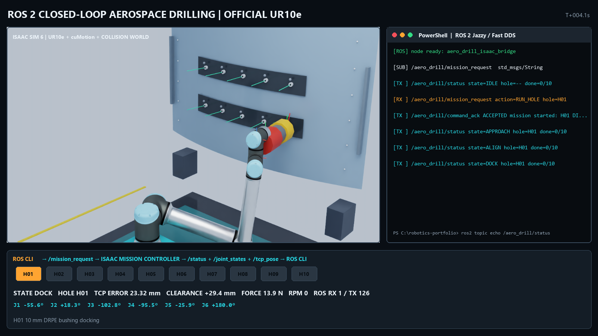
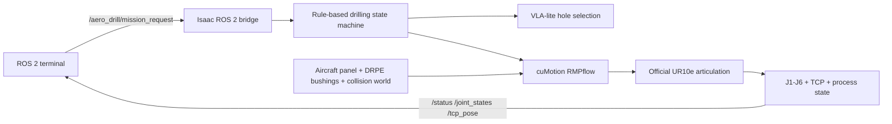

# Aerospace OLP Digital Twin with ROS 2 + NVIDIA Isaac Sim

A standalone aerospace-manufacturing robotics portfolio project that recreates a deterministic offline-programming workflow with an official UR10e articulation, ROS 2 command and telemetry interfaces, collision-aware motion, and a DRPE-style drilling task.

This standalone repository focuses exclusively on the aerospace drilling OLP workflow.



[Watch the ROS 2 closed-loop demonstration](recordings/aero_drill_ros_full.mp4)

## Engineering objective

Traditional aerospace OLP tools such as DELMIA and RoboDK provide more than point sequencing. They maintain the geometric relationship among the aircraft, fixture, robot base, flange, calibrated TCP, hole center, and surface-normal direction.

This project preserves that deterministic frame discipline while adding an open ROS 2 runtime interface and an Isaac Sim digital twin:



The deterministic process is:

`APPROACH -> ALIGN -> DOCK -> CLAMP -> DRILL -> VERIFY -> RETRACT`

## Included

- NVIDIA Isaac Sim UR10e USD articulation with six revolute joints
- Curved aircraft-panel surrogate with frames, stringers, rivets, and ten DRPE-style bushings
- World/base, TCP, active-hole, and J1-J6 coordinate-frame visualization
- Collision-aware cuMotion RMPflow task-space control
- Rule-based drilling state machine and trained VLA-lite hole-selection checkpoint
- Bidirectional ROS 2 Jazzy/Fast DDS command and telemetry bridge
- External ROS terminal node for selected-hole, batch, and monitor modes
- Repeatable headless test and video-recording pipeline
- LinkedIn-ready project post and technical source notes

## Requirements

- Windows 11
- NVIDIA Isaac Sim 6.x installed at `C:\isaacsim`
- NVIDIA RTX GPU; validated on an RTX 4070 Ti 12 GB
- ROS 2 Jazzy Pixi workspace at `C:\IsaacSim-ros_workspaces\jazzy_ws`
- PowerShell and Git LFS

## Quick start

```powershell
cd C:\aerospace-olp-ros2-isaacsim
Set-ExecutionPolicy -Scope Process Bypass
.\scripts\build.ps1
.\scripts\start_aero_drill_ros.ps1
```

In a second PowerShell window:

```powershell
cd C:\aerospace-olp-ros2-isaacsim
.\scripts\aero_drill_terminal.ps1 -Action hole -Hole H01
```

Other terminal modes:

```powershell
.\scripts\aero_drill_terminal.ps1 -Action batch
.\scripts\aero_drill_terminal.ps1 -Action monitor
```

## ROS 2 interface

| Direction | Topic | Type |
| --- | --- | --- |
| ROS 2 to Isaac | `/aero_drill/mission_request` | `std_msgs/msg/String` |
| Isaac to ROS 2 | `/aero_drill/command_ack` | `std_msgs/msg/String` |
| Isaac to ROS 2 | `/aero_drill/status` | `std_msgs/msg/String` |
| Isaac to ROS 2 | `/aero_drill/joint_states` | `sensor_msgs/msg/JointState` |
| Isaac to ROS 2 | `/aero_drill/tcp_pose` | `geometry_msgs/msg/PoseStamped` |

## Record the demonstration

```powershell
.\scripts\record_aero_drill.ps1 -MaxHoles 1
.\scripts\record_aero_drill_ros.ps1 -Hole H01
```

The ROS 2 video was validated as H.264, 1600 x 900, 15 fps. Its recorded run contains one external mission request, an accepted ACK, live joint/TCP feedback, and a complete return to `IDLE`.

## Verification

```powershell
C:\isaacsim\python.bat tests\isaac_aero_drill_smoke.py
C:\isaacsim\python.bat tests\isaac_aero_extension_smoke.py
C:\isaacsim\python.bat tests\isaac_aero_ur10e_motion_smoke.py
C:\isaacsim\python.bat tests\isaac_aero_ur10e_mission_smoke.py
```

Validated behavior includes:

- 10/10 logical hole sequence
- official UR10e reference and six revolute joints
- 20 environment collision shapes
- collision-aware task-space approach
- full H01 physical state sequence without a motion timeout
- actual ROS 2 command, ACK, state, J1-J6, and TCP exchange

## Repository layout

```text
isaacsim_exts/aero.drill.vla/    Isaac Sim extension
ros2_ws/src/aerospace_olp_bringup/ ROS 2 terminal package
ml/aero_drill_vla/               VLA-lite training
models/                          Trained checkpoint
scenes/                          Generated USD scene
scripts/                         Build, run, train, and record commands
tools/                           Headless capture and video composition
tests/                           Isaac Sim smoke tests
recordings/                      Validated demonstration media
linkedin/                        LinkedIn post package and references
```

## Fidelity boundary

The robot articulation and joint physics use the official Isaac Sim UR10e asset. The drilling head and aircraft panel are generic portfolio geometry, not OEM SETI-TEC or aircraft CAD. Force, feed, RPM, and quality values are synthetic. The tool mesh is not yet included in the cuMotion collision-sphere model.

This is a digital-twin and controls portfolio project, not a production-qualified aerospace drilling system.

See [the detailed implementation notes](docs/AERO_DRILL_VLA.md).
